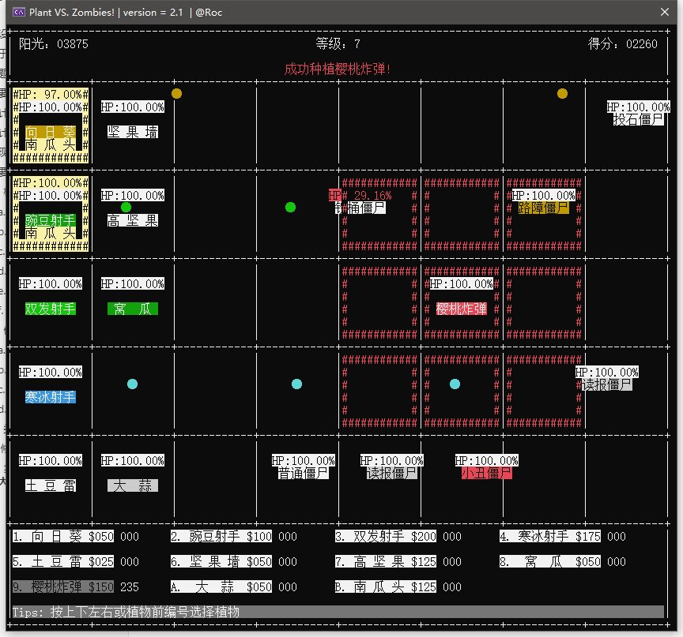
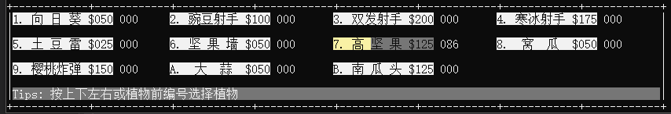
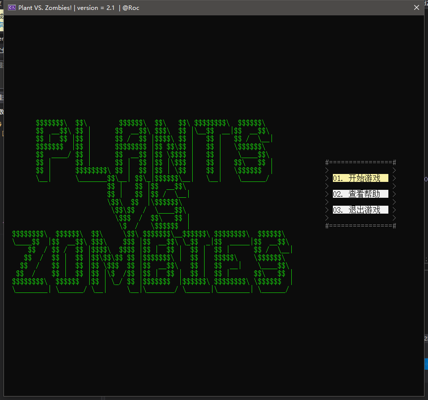
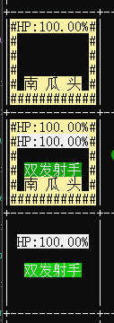

# 高级程序设计课程报告-第二阶段

姓名：王鹏

学号：191220112

[TOC]

## 一、关于课程设计

### 1. 选题

本学期课程设计选择复现植物大战僵尸

### 2. 主要内容

本阶段的主要内容是继续完善上一阶段的控制台应用，对植物大战僵尸游戏做一些功能拓展。

### 3. 设计目标

这一阶段的主要目标是对第一阶段的控制台应用做一些拓展，包括增加僵尸和植物的种类，商店交互的拓展，增加植物购买冷却，显示植物、僵尸血量等。

### 4. 设计思路

1. 本阶段的主要任务在于增加植物和僵尸的种类，基于第一阶段的植物基类（`Plant`，虚基类）和僵尸基类（`Zombie`，普通僵尸）进行继承，构造新的植物类和僵尸类，可以很方便得构造出新的植物和僵尸。

2. 此次拓展将对僵尸类做部分细节的重构，减少代码的冗余，增加相同代码复用率，将僵尸的移动和攻击函数合并，提取其中对于不同僵尸独有的特性在一个单独的函数中完成，使得僵尸种类的扩充更加方便。

3. 对于设计要求中的爆炸秒杀效果，可以设置植物/僵尸的攻击力为较大的值（超过所有植物/僵尸的生命值上限）以达到秒杀效果。
4. 对于设计要求中僵尸的特殊移动（撑杆僵尸跳跃和吃到大蒜换行），可以设置一个单独的变量记录特殊移动。
5. 投石僵尸的篮球可以继承子弹类，修改移动方向为向左即可。
6. 每个地块有多个僵尸、商店上下左右选择植物等已在上一阶段完成。

## 二、实现

### 1. 主要类的设计

#### 1）植物类拓展

（双发射手、坚果墙已在第一阶段完成）

##### a. 寒冰射手

继承植物基类，与豌豆射手相同，发射冰冻子弹，冰冻子弹继承普通子弹类。

```c++
// 寒冰射手类
class IceShooter : public Plant
{
	int ice_time;
public:
	IceShooter(int r, int c);
	void hit(); // 对攻击函数进行重载
};
// 冰冻子弹类
class IceBullet : public Bullet
{
private:
	int ice_time;
public:
	IceBullet(int x, int y, int speed, int atk, int color, BULLET id, int ice_time);
	bool move(); // 重载移动函数，改为向左移动
};
```

##### b. 高坚果

继承坚果类，增加血量（耐久度）。

##### c. 窝瓜

窝瓜属于爆炸类植物，会对攻击范围（一格）的所有僵尸造成秒杀效果。判定范围为3格，左边一格、自己所在格、右边一格。优先攻击左边。起跳后自身生命大幅增加（达到无敌效果，不可再被僵尸的秒杀效果秒杀），一旦起跳攻击状态不可逆。

爆炸类植物的攻击力极高。

```c++
class Squash : public Plant
{
	int attack; // 记录攻击状态（0判定、1起跳、2砸下（发起攻击）），起跳时无敌（不会被吃掉）
public:
	Squash(int r, int c);
	void hit();
};
```

##### d. 樱桃炸弹

樱桃炸弹也属于爆炸类植物，会对攻击范围（三格）内的所有僵尸造成秒杀效果。判定爆炸为固定时间，种植后固定时间后发生爆炸。

```c++
class Cherry : public Plant
{
	int attack; // 爆炸状态计数，达到3后爆炸
public:
	Cherry(int r, int c);
	void hit();
};
```

##### e. 大蒜

大蒜属于效果类植物。具体的效果不在大蒜本身的类中实现（自身只记录植物ID，在僵尸攻击（吃）植物时判断是否为大蒜）

```c++
class Garlic : public Plant
{
public:
	Garlic(int r, int c);
	void hit();
};
```

##### f. 南瓜头

南瓜头也属于效果类植物，可以叠加在其他植物之上，为其他植物提供保护。僵尸对植物进行攻击时，优先攻击南瓜头。

```c++
class Pumpkin : public Plant
{
public:
	Pumpkin(int r, int c);
	void hit();
};
```

#### 2）僵尸类拓展

（路障僵尸已在第一阶段完成）

##### a. 读报僵尸

读报僵尸会在报纸被打破后加快移动和攻击速度。处理办法：当血量低于 2 / 3 时（模拟报纸掉落），加快移动速度。

##### b. 撑杆僵⼫

撑杆僵尸可以跳过遇到的第一个植物（高坚果除外）。

```c++
class PoleVaulting : public Zombie
{
	int rod; // 记录是否有杆
	int jump; // 起跳时移动距离
public:
	PoleVaulting(int x, int y);
	int special(int move_flag, int eat_flag, Plant*& plant);
};

//具体处理跳跃的部分
{
    //...
    if (jump)
    {
        pos.col--;
        jump--;
        showZombie(*this);
        if (pos.col <= 0)
            alive = 0;
    }
    //...
}
```

##### c. ⼩丑僵⼫

小丑僵尸会在出生后一段（随机）时间后打开礼物盒，礼物盒爆炸对3格范围内的植物造成秒杀效果。

```c++
class Clown : public Zombie
{
	int boom_time;
	int boom_color;
	int boom_atk;
public:
	Clown(int x, int y);
	int special(int move_flag, int eat_flag, Plant*& plant);
};
```

爆炸时间在小丑僵尸出生（实例化一个对象）时设定一个随机数。

```c++
if (rand() % 100 < 95) // 95% 可能性后爆炸，出生后较长时间后爆炸
{
    boom_time = rand() % 500 + 750;
}
else // 5% 可能性前爆炸（出生后极短时间内爆炸
{
    boom_time = rand() % 400 + 150;
}
```

爆炸实现：

```c++
//...
if (boom_time == 0)
{
    for (int i = -1; i <= 1; i++)
        for (int j = -1; j <= 1; j++)
        {
            Plant* plant = plist.getPlant(r + i, c + j);
            if (plant != NULL)
                plant->beEaten(boom_atk);
        }
    //...
}
```

##### d. 投⽯僵⼫

投石僵尸出现时会有20颗篮球，如果当前行有植物且篮球未投完，就投出篮球对 植物进行打击，优先打击后排的植物。如果篮球投完或本行没有植物，就开车进行碾压，对接触到的植物造成秒杀效果。

```c++
class Throw : public Zombie
{
	int basketball;
	int basketball_atk;
	int basketball_as;
	int throw_count;
public:
	Throw(int x, int y);
	int special(int move_flag, int eat_flag, Plant*& plant);
};
```

投出篮球实现：

篮球继承子弹类，在攻击时发射一个篮球类的子弹。

```c++
int r = (pos.row - TOP_HIGH) / (ROW_HIGH + 1);
int max_c = pos.col / (COL_WIDTH + 1);
int c = 0;
Plant* p = plist.getPlant(r, c);
for (c = 1; c < max_c && !p; c++)
    p = plist.getPlant(r, c);
if (basketball > 0 && p)
{
    if (throw_count >= basketball_as)
    {
        throw_count = 0;
        COLOR = RED;
        basketball--;
        Basketball* blt = new Basketball(pos.col + COL_WIDTH - 2, pos.row + 1, 1, basketball_atk, DARK_YELLOW, BULLET::BASKETBALL, c - 1);
        blist.addBullet(blt);
    }
    else
        throw_count++;
    return 1;
}
```

#### 3）类之间的交互

除攻击与被攻击外，植物和僵尸类的交互主要体现在大蒜上。

僵尸（投石僵尸碾压和小丑僵尸爆炸除外，僵尸秒杀效果无视大蒜效果）在攻击植物时会读取植物的ID，判断植物是否为大蒜，如果是大蒜，就进行随机换行：

```c++
if (plant->getID() == PLANT::GARLIC && ZOMBIE_ID != ZOMBIE::THROW)
{
    pos.col--;
    if (pos.row == TOP_HIGH) // 第一行只能向下
        garlic += (ROW_HIGH + 1);
    else if (pos.row == ((ROW - 1) * (ROW_HIGH + 1) + TOP_HIGH)) //最后一行只能向上
        garlic += -(ROW_HIGH + 1);
    else //其他行随机移动
        garlic += ((rand() % 2) ? (ROW_HIGH + 1) : -(ROW_HIGH + 1));
}
```

### 2. UI 修改

#### 1）扩大地图中每个格子的大小

由于要添加南瓜头，植物的显示出现问题，因此扩大地图中每个格子的大小。



#### 2）植物冷却显示

如下图（高坚果），冷却用进度条的方式显示（右侧数字为测试时显示的剩余时间，正式版本不显示），如果要种植处于冷却中的植物，会在顶部提示“植物还在冷却”。



#### 3）添加游戏进入后的主界面

主界面有“开始游戏”、”查看帮助“、“退出游戏” 三个选项。在主界面按上下/左右进行选择，回车键确定选择。



## 三、功能亮点

### 1. 设计中的亮点

#### 1） 便于植物/僵尸种类拓展、修改

所有的植物/僵尸初始信息用数组存储，拓展植物时在数组中添加对应的信息即可。

```c++
//植物种类
#define PLANT_KIND_NUM 11
enum class PLANT {
	SUNFLOWER, //向日葵
	PEA_SHOOTER, //豌豆射手
	DOUBLE_SHOOTER, //双发射手
	ICE_SHOOTER, //寒冰射手
	POTATO, //土豆雷
	NUT, //坚果墙
	HIGH_NUT, //高坚果
	SQUASH, //窝瓜
	CHERRY, //樱桃炸弹
	GARLIC, //大蒜
	PUMPKIN //南瓜头
};

//僵尸种类
#define ZOMBIE_KIND_NUM 7
enum class ZOMBIE {
	ORDINARY, //普通僵尸
	BARRICADE, //路障僵尸
	BUCKETHEAD, //铁桶僵尸
	NEWSPAPER,//读报僵尸
	POLE_VAULTING, //撑杆僵尸
	CLOWN, //小丑僵尸
	THROW //透视僵尸
};

// 植物信息
static int _HP[] = { 100, 120, 120, 120, 30, 1000, 2000, 100, 100000, 160, 1000 }; // 植物血量
static int _ATK[] = { 25, 15, 15, 20, 1000, 0, 0, 1000, 1000, 0, 0 }; // 植物攻击力
static int _AS[] = { 1500, 50, 50, 50, 0, 0, 0, 20, 20, 0, 0 }; // 植物攻击速度，用等待值显示，ms
static int _PLANT_COLOR[] = { DARK_YELLOW, GREEN, GREEN, CYAN, WHITE, WHITE, WHITE, DARK_GREEN, RED, DARK_WHITE, YELLOW }; // 植物颜色
const char* _PLANT_NAME[] = { "向 日 葵", "豌豆射手", "双发射手", "寒冰射手", "土 豆 雷", "坚 果 墙", "高 坚 果", " 窝  瓜 ", "樱桃炸弹", " 大  蒜 ", "南 瓜 头" }; // 植物名字
int _COST[] = { 50, 100, 200, 175, 25, 50, 125, 50, 150, 50, 125 }; // 植物花费
#ifdef DEBUG // DEBUG 模式为了便于测试，冷却时间较短
int _WAIT[] = { 25, 25, 25, 30, 100, 100, 150, 150, 250, 50, 150 }; // 商店冷却
#else
int _WAIT[] = { 250, 250, 250, 300, 1000, 1000, 1500, 1500, 2500, 500, 1500 }; // 商店冷却
#endif

// 僵尸信息
static int _HP[] = { 120, 240, 360, 360, 240, 240, 500 }; // 僵尸血量
static int _ATK[] = { 8, 8, 8, 10, 10, 10, 10000 }; // 僵尸攻击力
static int _AS[] = { 30, 30, 30, 30, 30, 30, 40 }; // 僵尸攻击速度，用等待值显示，ms
static int _MS[] = { 20, 20, 20, 20, 10, 25, 40 }; // 僵尸移动速度，用等待值显示，ms
static int _ZOMBIE_SCORE[] = { 10, 15, 25, 35, 35, 40, 50 };
static int _ZOMBIE_COLOR[] = { WHITE, DARK_YELLOW, GREY, DARK_WHITE, BLUE, RED, WHITE }; // 僵尸颜色
const char* _ZOMBIE_NAME[] = { "普通僵尸", "路障僵尸", "铁桶僵尸", "读报僵尸", "撑杆僵尸", "小丑僵尸", "投石僵尸" }; // 僵尸名字
```

#### 2） 使用宏定义来设置一些常量值，使其在使用时更方便

```c++
// 颜色
#define BLACK 0x0
#define DARK_BLUE 0x1
#define DARK_GREEN 0x2
#define DARK_CYAN 0x3
#define DARK_RED 0x4
#define DARK_PURPLE 0x5
//...

// 按键
#define UP 72
#define LEFT 75
#define RIGHT 77
#define DOWN 80
#define ENTER 13
#define ESC 27
#define BACKSPACE 8
#define NUM0 48
#define NUM1 (NUM0+1)
#define NUM2 (NUM0+2)
//...
#define KB_a 97
#define KB_b (KB_a+1)
#define KB_A 65
#define KB_B (KB_A+1)
//...
```

### 2. 功能上的亮点

#### 1）使用控制台字体颜色实现更丰富的UI

通过对系统函数 `SetConsoleTextAttribute` 进行简单的封装实现自己的修改颜色的函数，可以更方便得修改控制台字体颜色，实现更丰富的 UI

#### 2）爆炸效果复用

在显示部分定义显示爆炸效果的函数，在窝瓜、樱桃炸弹、小丑僵尸等处都可以复用。

## 四、操作

基本操作与第一版无异，添加主菜单UI，在主菜单中按上下或左右选择项目，按回车键进入。

在游戏进行过程中，添加按退格（Backspace）键退出游戏的功能，按下退格键后，会提示用户是否确认退出，按Enter键进行确认，Esc键取消。

## 五、遇到的问题与解决办法

## 1. 南瓜头设计问题

由于之前设计结构的限制，地图中每个格子只能有一种植物，南瓜头在其他植物上叠加时较难实现，解决办法是在植物列表中添加一项存储南瓜头的列表，南瓜头与普通植物分开存储，种植时普通植物与普通植物会冲突，而不会和南瓜头冲突，南瓜头只会和南瓜头冲突。显示时南瓜头特殊显示：

以下分别是：单独的南瓜、南瓜加普通植物、普通植物



## 2. 上一阶段设计遗留的问题：豌豆射手等前方无僵尸而后方有僵尸时也会发射子弹

修改发射子弹的判断方式为前方有僵尸时才发射。

## 3. 窝瓜在进攻时是分阶段的，如果在中间某一阶段时恰好前方僵尸死亡，窝瓜将卡在当前阶段

解决办法就是窝瓜进攻阶段的变化不只在判定范围内有僵尸时才进行，如果状态进入“起跳”阶段，后续变化不在根据僵尸而改变。