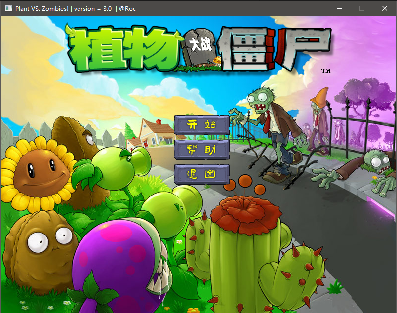
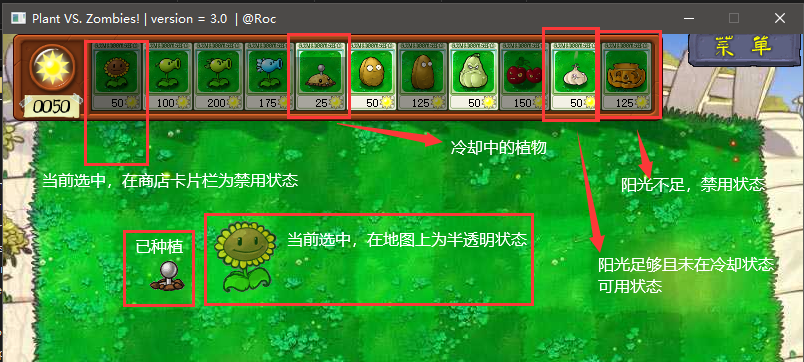
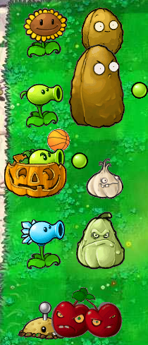
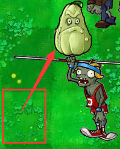
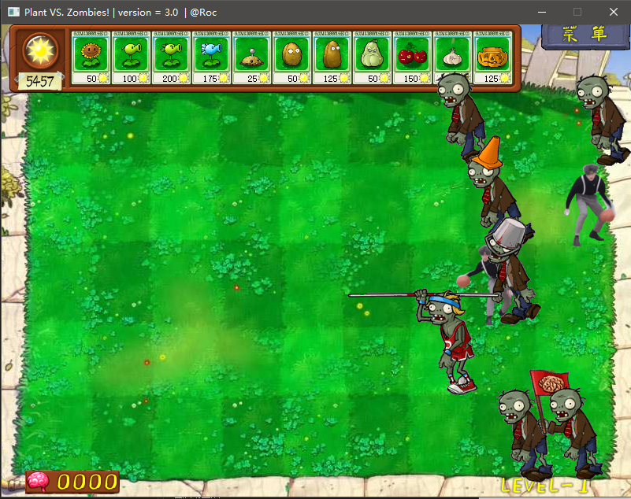
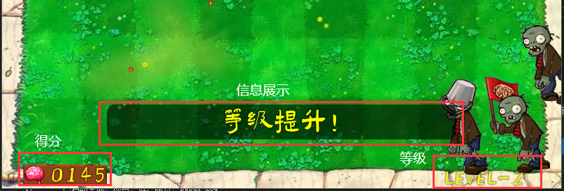
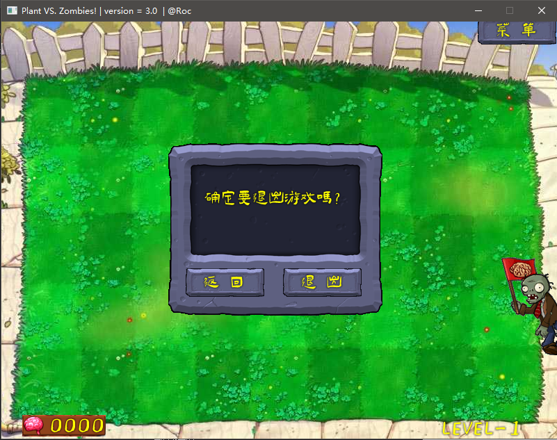
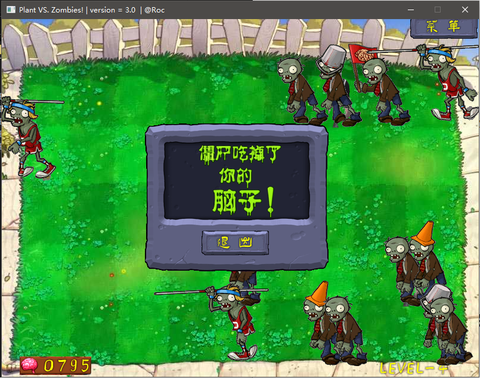
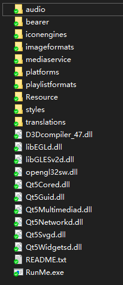

# 高级程序设计课程报告-第三阶段

姓名：王鹏

学号：191220112

## 一、关于课程设计

### 1. 选题

本学期课程设计选择复现植物大战僵尸

### 2. 主要内容

本阶段的主要内容是将前两个阶段实现的控制台版本的植物大战僵尸拓展为 GUI 版本，并添加一些额外的功能。

### 3. 设计目标

将控制台的全部 UI 转换为基于 Qt 的图形界面 UI，将键盘操作转换为鼠标操作。

添加背景音乐和音效等；添加暂停功能。

### 4. 设计思路

由于之前设计的控制台版本的植物大战僵尸中，逻辑处理和 UI 处理是分离的，所以只需要将 UI 部分转换为 GUI 即可。例如，控制台版本的显示植物是打印一些字符串，转换为 GUI 版本只需要将打印字符串的操作改为显示图片的操作；键盘 上下左右 + `Enter` 选择某项改为鼠标点击某项；循环执行的事件改为 `QTimer` 驱动的函数。

## 二、实现

### 1. 植物、僵尸、子弹类提升为 UI 类（以植物为例）

将原来的植物、僵尸和子弹基类( `Plant`, `Zombie`, `Bullet` )提升为 `Q_OBJECT`，并继承 Qt 窗口部件 `QWidget` 称为 UI 类，如下：

```c++
class Plant: public QWidget
{
protected:
	//...
+	QMovie* movie;
+	QLabel* processLabel;
public:
	//...
	//显示植物，友元函数，在UI模块定义
-	friend void showPlant(const Plant& plant);
-	friend void fixPlant(const Plant& plant);
+	void changeMovie(const char* path, int width, int high);
};
```

使用 `QMovie` 来显示植物对应的 gif 图像，并用一个 `QLabel` 承载。

在初始化一个植物对象时，对 `movie` 设定图片路径并进行播放。需要注意的是，这里 `new` 得到的内容并不需要在析构函数中进行 `delete` ,因为 Qt 本身可以识别这些内容，在 `QWidget` 对象销毁时，其子部件都将销毁。

```c++
Plant::Plant(PLANT pid, int r, int c) :
	PLANT_ID(pid), pos(r, c), status_count(0), valid(1), QWidget(UI_Game::bg), status(0)
{
	//...
	setGeometry(x, y, _WIDTH[(int)pid], _HIGH[(int)pid]);
	show();
	setStyleSheet("background-image:url();");
	char movie_path[100] = "";
	sprintf(movie_path, "Resource/images/Plants/%s/%s.gif", _PLANT_PATH[(int)pid], _PLANT_PATH[(int)pid]);
	movie = new QMovie(movie_path);
	processLabel = new QLabel(this);
	processLabel->setMovie(movie);
	processLabel->setGeometry(0, 0, _WIDTH[(int)pid], _HIGH[(int)pid]);
	processLabel->setAttribute(Qt::WA_TranslucentBackground, true);
	processLabel->show();
	movie->start();
        
    //...
}
```

### 2. 提升商店为 UI 类（`Shop.h/cpp`）

同样，将原有的商店类设为 `Q_OBJECT`，继承 `QWidget` 。

添加植物卡片，阳光数量的显示等子部件，将植物卡片的点击事件与原有的选择植物的函数相关联。

### 3. 添加背景、菜单、游戏界面等 UI 类

#### 1）背景（`Background.h/cpp`)

顾名思义，即整个程序的背景，用来切换主界面和游戏界面、帮助界面的不同背景，同时作为承载所有植物、僵尸、子弹、商店部件的祖先部件，其他所有的部件都依托于背景。

背景本身的设定非常简单，只有两个方法，即：

```C++
void setBackground(const char* path); // 修改背景
void changeMusic(const char* path); // 修改背景音乐
```

#### 2）菜单（`UI_Menu.h/cpp`）

主要的交互按钮都集成在菜单类中，包括主界面的”开始“、”帮助“和”退出“以及游戏界面的返回菜单等。

为了所有的按钮具有相同的样式又可以较大程度的实现代码复用，设计了 `MyBaseButton` 类，对其进行了一些基础的属性设定，所有的按钮都继承于该类。

此外，一些信息的显示也继承在菜单类中，包括得分( `score` 标签 )的显示，游戏当前等级( `level` 标签 )的显示、提示信息( `message` 标签 )的显示等。

#### 3）游戏界面（`UI_Game.h/cpp`）

该类主要用于继承原本为全局变量的一些内容（一局游戏的属性），如植物列表、僵尸列表和子弹列表，得分、阳光数和等级等等。

对外提供一些基础的函数用于修改这些数据，本身主要用到的方法包括：开始、暂停、继续和退出

```c++
static void Start();
static void Pause();
static void Continue();
static void Quit();
```

## 三、信号与槽——交互的灵魂

在 Qt 的众多部件之间进行交互的主要机制是信号与槽。可以通过主动将一个部件的信号与另一个部件的槽绑定在一起，当前者发送信号时，后者捕获信号并执行槽函数。

在本次实验中，用到信号和槽机制的主要是各个按钮的点击信号。例如，主菜单的“开始”按钮与菜单类的开始游戏的信号绑定，当点击“开始”按钮的时候，就调用菜单栏的开始游戏槽函数，对各个部件的显隐性进行修改，并执行 `UI_Game` 的开始游戏函数。此外，还体现在购买植物的操作中。点击商店的植物卡片，触发商店的选择植物槽函数，再次点击地图上的位置，触发种植槽函数。

## 四、与前两个阶段的关联

有了信号与槽机制后，对之前的程序复用就不再是难事了。由于之前已经写好了各种逻辑的处理函数，只需要将之前的一些函数注册为槽函数并和按钮的一些点击事件等绑定，就可以轻松的将键盘操作执行的函数转换为鼠标操作。

所以，第三阶段可以复用上一个阶段几乎所有的逻辑处理部分的代码而不需要进行重构。

## 五、程序运行操作及展示

### 1. 主界面：

主界面主要展示 Logo 和三个基础按钮：开始游戏、帮助和退出



点击开始按钮进入游戏。

### 2. 游戏界面

#### 1）商店

点击植物，会进入选定植物状态，鼠标悬停在地图上会显示即将种植的位置，点击左键确定种植，单击右键或点击地图之外的部分取消种植。如果当前位置已有植物，需要**双击**左键来确定种植。种植植物后，植物会进入冷却状态，显示为暗色的进度条。



#### 2）植物

所有的植物种类展示：



樱桃炸弹爆炸效果：


窝瓜起跳效果：



#### 3）僵尸

由于没有找到读报僵尸、小丑僵尸和投篮僵尸的素材，使用其他素材代替：

小丑僵尸：摇旗僵尸

读报僵尸：普通僵尸

投篮僵尸：鸡你太美



#### 4）信息展示



### 3. 暂停

点击右上角菜单键弹出退出游戏提示框，此时即处于暂停状态，点击返回回到游戏，点击退出回到主界面：



### 4. 游戏失败

点击退出回到主界面



## 六、遇到的问题及解决办法：

### 1. 购买植物时如何确定种植的位置

在 `Shop` 的成员类 `MapSelector` （在前两个阶段中已实现）中创建一个和地图相同大小的透明部件，捕捉鼠标事件，当鼠标移动时，计算要种植的坐标并在地图上以半透明的方式显示，当点击左键时，确定种植，点击右键时取消种植。

### 2. 僵尸遮挡地图、商店时无法点击

为植物类、僵尸类等可能遮挡商店地图等的部件设置鼠标穿透

```c++
setAttribute(Qt::WA_TransparentForMouseEvents, true);
setWindowFlags(Qt::FramelessWindowHint);
setAttribute(Qt::WA_TranslucentBackground);
```

### 3. Qt 6 无法播放音乐

`QMovie` 部件需要使用 Qt 支持库 `QtMultimedia`，而 Qt6 已经将这个库删除，只能使用较低版本的 Qt 5 来实现。

### 4. 导出的 exe 文件不能直接运行

使用 Qt 附带的 `windeplyqt` 命令将 exe 依赖的包提取到所在文件夹，具体操作：

将 `$PATH_TO_QT/bin` 添加到环境变量，将生产的 exe 文件单独放到一个文件夹，执行 `windeployqt out.exe` 命令即可。执行完成后目录文件如下：



