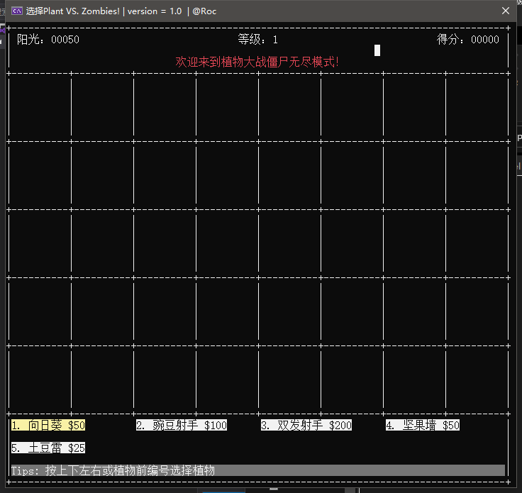
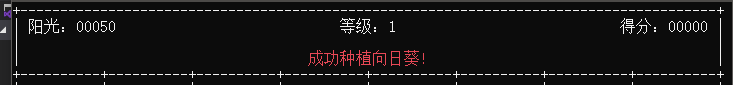
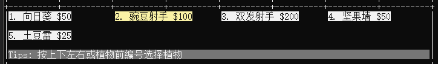
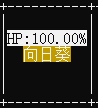
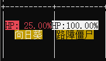
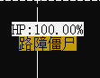
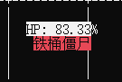
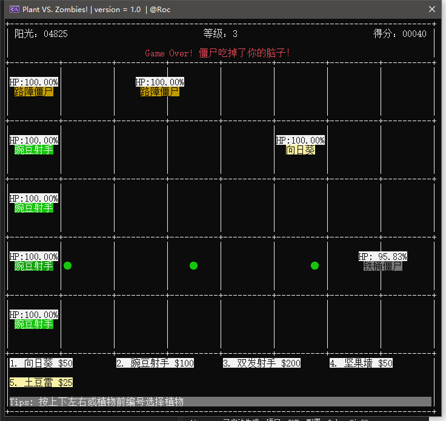
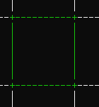
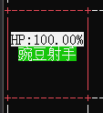

# 高级程序设计课程报告-第一阶段

姓名：王鹏

学号：191220112

[TOC]

## 一、关于课程设计

### 1. 选题

本学期的课程设计我选择了复现植物大战僵尸

### 2. 主要内容

复现植物大战僵尸的第一阶段主要是实现一个可以在控制台中进行游戏交互的版本。主要模仿原版植物大战僵尸实现植物的种植、攻击、被攻击，僵尸的随机产生、移动、攻击、被攻击，阳光的收集、消耗等。

### 3. 设计目标

初步设计目标为实现至少一种植物——豌豆射手和一种僵尸——普通僵尸，地图的大小至少为 3 * 7，以及一些其他的基本功能比如阳光的自然产生，植物的购买与种植，以及游戏积分等功能。

### 4. 设计思路

对于每一种类，应该先设计一种简单的类，在后续添加功能时逐步完善。而对于每一种具体的植物和僵尸，可以继承植物类和僵尸类，所以本次课程设计将主要以继承的方式完成大部分类的设计。例如，我们可以将所有植物共同的属性在植物基类中设定，而对于不同的部分，则在每个子类中设定，比如血量、攻击力等是每个植物都具有的（没有攻击性的比如坚果墙可以让其攻击力为0），而攻击方式确实每种植物不同的，所以我们可以在基类中设定血量和攻击力，而在子类中设计攻击方式（比如发射子弹或者发生爆炸）。

## 二、如何实现

### 1. 需求分析

将复现植物大战僵尸的需求细分，我们需要实现的代码至少包括：植物类、僵尸类、商店类等。

对于植物类，应该有一些属性值包括植物类型、种植消耗、满血量、当前血量、攻击速度、攻击力、坐标等，应当具有的函数包括攻击、在地图中显示等。

对于僵尸类，应该有的属性包括僵尸类型、满血量、当前血量、攻击速度、移动速度、攻击力、坐标等，应当具有的函数包括移动、攻击（只有在植物面前才有效）、在地图中显示等。

对于商店类，应当具有的函数包括购买植物、选定坐标等。

### 2. 基类的设计

#### 1) 植物类

根据需求分析以及后续的一些调整，设计如下植物类，对于植物类，每一种植物的攻击方式都不同，所以将植物的基类设计为虚类，每种植物都继承植物类。

```c++
class Plant
{
protected:
	PLANT PLANT_ID; //植物id，表示种类，枚举类型
	int FULL_HP; //植物满血血量
	int ATK; //攻击力
	int AS; //攻速
	int COLOR; //植物显示颜色
	int current_hp; //植物当前血量
	bool valid; //是否存活
	Pos pos; //植物位置
	int status_count; //攻击状态计数，达到等待时间后攻击
	int color_count; //颜色变化计数
public:
	//构造函数，提供植物类型和坐标
	Plant(PLANT pid, int x, int y);
	//被吃，返回存活状态
	bool beEaten(int atk);
	//获取植物坐标
	Pos getPos() const;
	//获取植物存活状态
	bool isValid() const;
	//攻击，纯虚函数，在具体的植物类中定义
	virtual void hit() = 0;
	//显示植物，友元函数，在UI模块定义
	friend void showPlant(const Plant& plant);
	friend void fixPlant(const Plant& plant);
};
```

#### 2) 僵尸类

根据需求分析以及后续的一些调整，设计如下僵尸类，由于普通僵尸的所有属性都是其他僵尸所具有的，所以僵尸类的基类就可以作为一种普通僵尸。

```c++
class Zombie
{
protected:
	ZOMBIE ZOMBIE_ID; //僵尸id，表示种类，枚举类型
	int FULL_HP; //僵尸满血血量
	int ATK; //攻击力
	int AS; //攻速
	int MS; //移速
	int COLOR; //僵尸显示颜色
	int ZOMBIE_SCORE; //僵尸死亡得分
	int current_hp; //僵尸当前血量
	bool valid; //是否存活
	Pos pos; //僵尸位置
	int status_count; //攻击状态计数，达到等待时间后攻击
	int color_count; //颜色变化计数
public:
	//构造函数，提供僵尸类型和坐标，坐标是所在单元的左上角
	Zombie(ZOMBIE zid, int x, int y);
	//被打，返回存活状态
	virtual bool beHit(int atk);
	//获取僵尸坐标
	Pos getPos() const;
	//获取僵尸存活状态
	bool isValid() const;
	//攻击，虚函数
	virtual void eat(Plant* plant);
	//移动，虚函数
	virtual void move();
	//显示僵尸，友元函数，在UI模块定义
	friend void showZombie(const Zombie& zombie);
	friend void fixZombie(const Zombie& zombie);
};
```

#### 3) 商店类

设计如下商店类，为了实现植物的选择与种植地点的选择，补充设计植物选择子和地图选择子两种类。

```c++
//植物选择子，用于指示将要购买的植物种类
class PlantSelector
{
private:
	int pid;
public:
	PlantSelector();
	void move(int direction);
	void setPant(int pid);
	int getPlant() const;
};
//地图选择子，用于指示将要种植植物的地点
class MapSelector
{
private:
	Pos pos;
public:
	MapSelector();
	void move(int direction);
	Pos getPos() const;
};
class Shop
{
private:
	PlantSelector ps;
	MapSelector ms;
	int status; // 0选择植物，1选择地图位置，2购买植物冲突
	bool buyPlant(int sure);
public:
	Shop() :status(0) {}
	// 选定植物
	void choosePlant();
	// 取消选定植物
	void unchoosePlant();
	// 进行操作
	void shopOperate(int key);
	//显示商店信息
	friend void showShop();
	friend void fixShop();
};
```

### 3. 子类的设计

#### 1) 植物类

我们如果要设计不同的植物类型，可以基于植物基类对每一种类型的植物设计一种子类，在本次设计中，我设计了如下子类：

```c++
//向日葵
class Sunflower : public Plant
{
public:
	// 构造函数，传递行列号
	Sunflower(int r, int c);
	// 向日葵用攻击函数作为产生向日葵的函数
	void hit();
};
//豌豆射手
class PeaShooter : public Plant
{
public:
	// 构造函数，传递行列号
	PeaShooter(int r, int c);
	// 攻击函数
	void hit();
};
//双发射手
class DoubleShooter : public Plant
{
private:
	int hit_count;
public:
	// 构造函数，传递行列号
	DoubleShooter(int r, int c);
	// 攻击函数
	void hit();
};
//坚果墙
class Nut : public Plant
{
public:
	Nut(int r, int c);
	void hit();
};
//土豆雷
class Potato : public Plant
{
	bool is_ready;
	int ready_count;
public:
	Potato(int r, int c);
	void hit();
};
```

#### 2) 僵尸类

对于其他僵尸，可以继承普通僵尸类来实现

```c++
//路障僵尸，血量较高，死亡分为两个阶段
class Barricede : public Zombie
{
public:
	Barricede(int x, int y);
	void eat(Plant* plant);
	void move();

};
//铁桶僵尸，血量更高，死亡分为三个阶段
class Buckethead : public Zombie
{
public:
	Buckethead(int x, int y);
	void eat(Plant* plant);
	void move();

};
```

### 4. 一些补充类

为了更方便的实现需求，还需要设计一种植物列表类，记录所有地图上的植物，并负责遍历植物进行操作（攻击等），一种僵尸列表类，记录所有在地图上的僵尸，并负责遍历僵尸进行操作（移动、攻击等）。

此外，大部分植物的攻击方式为发射子弹，所以还需要设计一种子弹类，同样，对于子弹类的操作，设计一种子弹列表类。

#### 1) 植物列表类：

由于地图上每个格子只能有一个植物，所以可以用 `std::map` 数据结构来存储所有的植物。

```c++
class PlantList
{
private:
	std::map<Pos, Plant*, Pos_less> plant_list;
public:
	PlantList();
	// 添加植物，sure参数表示确定覆盖旧植物
	bool addPlant(Plant* plant, bool sure = 0);
	// 遍历每个植物做一次 hit 函数
	void plantsOperate();
	Plant* getPlant(int r, int c);
};
```

#### 2) 僵尸列表类

僵尸在地图上可以是任意位置，同一位置也可以有不同的僵尸，所有可以用 `std::vector` 数据结构来存储僵尸。

```c++
class ZombieList
{
private:
	std::vector<Zombie*> zombie_list;
	int create_count;
	int create_time;
public:
	ZombieList();
	// 添加僵尸
	void addZombie(Zombie* zombie);
	// 遍历每个僵尸做一次 move 函数
	void zombieOperate();
	// 获取某一坐标的僵尸
	Zombie* getZombie(int x, int y);
	// 获取某一行所有僵尸
	std::vector<Zombie*> getZombie(int r);
};
```

#### 3) 子弹类和子弹列表类

目前只设计了一种子弹类，具有的属性包括移动速度，攻击力等。后续设计其他子弹类型（比如寒冰射手的减速子弹），可以用继承的方式从原有子弹类继承。子弹列表类同样用 `std::vector` 结构存储。

```c++
class Bullet
{
protected:
	int pos_x;
	int pos_y;
	int speed;
	int atk;
	bool valid;
	int color;
	int status_count;
public:
	Bullet(int x, int y, int speed, int atk, int color);
	// 移动，返回子弹是否消亡（撞击敌人或移动到屏幕外消亡）
	virtual bool move();
	// 显示子弹，友元函数，在UI模块定义
	friend void showBullet(const Bullet& blt);
	friend void fixBullet(const Bullet& blt);
};

class BulletList
{
private:
	std::vector<Bullet> bullet_list;
public:
	BulletList();
	// 添加子弹
	void addBullet(Bullet blt);
	// 子弹移动
	void bulletOperate();
};
```

### 5. 类与类之间的关系

首先，植物类和僵尸类之间可以互相攻击，植物类通过构造子弹类将攻击权限转移给子弹类，子弹类通过自己的攻击函数调用僵尸的被攻击函数，来实现僵尸的血量减少；僵尸类通过自己的攻击函数来调用植物的被攻击函数来实现植物的血量减少。

所有的具体类型的植物类都继承于植物基类。

所有的具体类型的僵尸类（普通僵尸除外）都继承于僵尸基类。

商店类可以通过向植物列表类添加植物的方式来购买并种植植物。

### 6. 关于UI

由于此次课程设计是基于控制台的，所以对于控制台的一些控制指令就显得尤为重要，包括修改控制台窗口大小，修改字体颜色，修改光标位置，隐藏光标等。

本次设计主要通过先修改光标位置和字体颜色，再进行打印的方式实现整个界面的绘制。

操作使用键盘的上下左右键和数字键等实现对选择子的移动来进行交互。

一些界面截图如下：

整体界面：



信息面板：



商店面板：



植物的显示：

植物在血量低于30%的时候PH条会变成红色，植物在进行攻击时会有略微的颜色变化





僵尸的显示：

僵尸的血量低于30%时PH条会变成红色，在进行攻击时也会发生略微的颜色变化，在受到攻击低会变成红色。






游戏结束：



## 三、操作

游戏的操作比较简单，方向键选择植物（黄色所指示）后，按回车键准备种植，或直接按对应的数字即进入准备种植状态，地图上出现绿色方框如下



继续按方向键调整种植位置再次回车种植在所选位置，或者按Esc取消种植。

如果所选位置已有植物，绿色框会变成红色来提醒，此时按回车会提示当前位置已有植物，再次回车会用新植物覆盖掉原有植物，Esc取消种植或方向键重新选择位置。



## 四、遇到的问题与解决方案

### 1. 如果用刷屏的方式进行打印，屏幕会一直闪烁

解决方法是用修改光标位置的方法直接对要修改的内容重新打印覆盖原有内容来达到绘制界面的效果

### 2. 如何设计能够使得 UI 在后续使用图形化界面的时候更容易的修改

解决方法是将所有的 UI 单独设计一个模块，对其他类提供接口函数来实现绘制，在后续转用图形界面的时候保证接口不变就可以方便的进行转换。